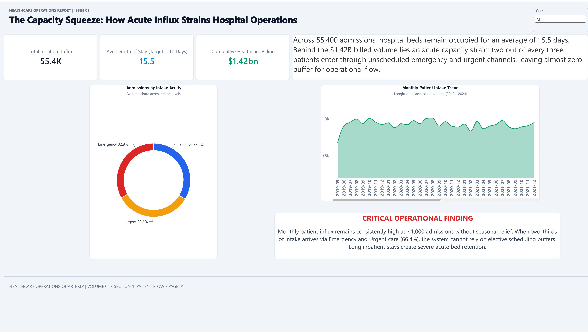

# 🏥 Inpatient Operations & Clinical Capacity Command Center (Power BI)

[](https://powerbi.microsoft.com/)
[](https://learn.microsoft.com/en-us/dax/)
[]()
[](Docs/Hospital_Operations_Capacity.pdf)

---

## 📌 Executive Summary
Hospital administrative workflows require continuous operational telemetry to balance inpatient bed utilization against clinical care delivery and expenditure containment. 

This **Inpatient Operations & Capacity Command Center** is an interactive Power BI analytics suite engineered to analyze **55,000+ patient admissions**, departmental length of stay (ALOS), prolonged bed occupancy (>20 days), triage acuity classifications, and **$1.42B in clinical billing expenditures**.

The report bridges clinical oversight with hospital financial intelligence, providing administrators with the tools to diagnose ward bottlenecks and optimize patient throughput.

---

## 📸 Dashboard Overview (Executive Summary View)


> 📄 **Technical Report:** Detailed clinical definitions, KPI formulas, and data architecture are documented in [`Docs/Hospital_Operations_Capacity.pdf`](Docs/Hospital_Operations_Capacity.pdf).

---

## 🎯 Key Operational & Financial Metrics
* **Total Encounters Analyzed:** 55,000+ patient admissions across inpatient hospital units.
* **Expenditure Monitored:** $1.42B in aggregated clinical billing charges.
* **Average Length of Stay (ALOS):** Tracked across admission categories (Emergency, Urgent, Elective).
* **Extended-Stay Bottlenecks:** Isolated inpatient encounters exceeding 20 days to mitigate bed blockages.
* **Triage & Acuity Distribution:** Monitored case acuity to evaluate clinical workload across shifts.

---

## 🛠️ Data Architecture & DAX Formulations

### 1. Data Model Structure
* **Fact:** Inpatient admission records tracking billing charges, triage acuity levels, admission/discharge timestamps, and room allocations.
* **Dimensions:** Standardized dimension tables for Patient Demographics, Clinical Specialties, Admission Types, and Date Hierarchies.

### 2. Core DAX Calculations

#### Average Length of Stay (ALOS):
```dax
ALOS = 
AVERAGEX(
    KEEPFILTERS(VALUES('Fact_Admissions'[Admission_ID])),
    CALCULATE(AVERAGE('Fact_Admissions'[LengthOfStay_Days]))
)
